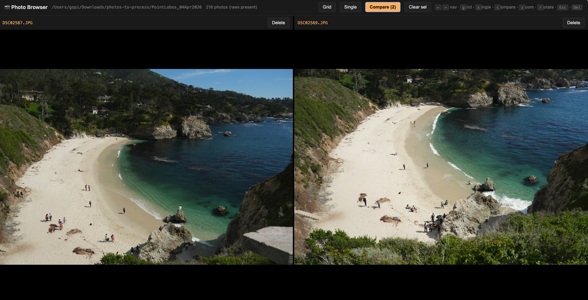
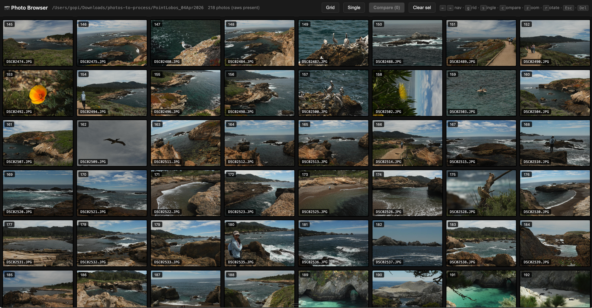
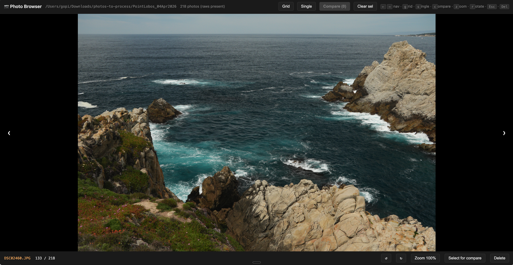

# photo-browser

A lightweight, self-contained photo culler for reviewing, comparing, and deleting photos from a trip. Built for photographers who shoot **JPEG + RAW** and want a fast way to pick keepers.



## Features

| Grid | Single photo |
|---|---|
|  |  |

- Thumbnail grid over a folder of JPEGs
- Single-photo view with prev/next navigation
- Side-by-side compare mode for any two photos
- Click-to-zoom to 100%, centered on the click point
- Per-photo rotate (view-only — does not touch the file)
- One-click delete that moves **both the JPEG and its matching RAW** (`.ARW`, `.CR2`, `.NEF`, `.DNG`, `.RAF`) into a `_deleted/` folder — recoverable, never `rm`'d
- Single static binary — HTML/CSS/JS embedded at compile time
- Thumbnails cached to disk after first render

## Install

Requires Rust 1.75+.

```bash
cargo install --git https://github.com/gopikori/photo-browser
```

Or build locally:

```bash
git clone https://github.com/gopikori/photo-browser
cd photo-browser
cargo build --release
./target/release/photo-browser <folder>
```

## Usage

Point it at a trip folder that contains a `jpegs/` subfolder (case-insensitive), and optionally a `raws/` sibling:

```
my-trip/
├── jpegs/
│   ├── DSC001.JPG
│   └── ...
└── raws/
    ├── DSC001.ARW
    └── ...
```

```bash
photo-browser ~/photos/my-trip
```

The server binds to a free local port and opens your browser automatically.

## Keyboard shortcuts

| Key                 | Action                         |
|---------------------|--------------------------------|
| `←` / `→`           | Previous / next photo          |
| `g`                 | Grid view                      |
| `s`                 | Single view                    |
| `c`                 | Compare view (with 2 selected) |
| `z`                 | Toggle zoom                    |
| `r` / `Shift+R`     | Rotate right / left            |
| `Space`             | Toggle selection for compare   |
| `Delete` / `Backspace` | Delete current photo        |
| `Esc`               | Zoom out → back to grid        |

**Selecting photos for compare:** double-click a thumbnail, or `Shift+click` / `Cmd+click`, or press `Space` while in single view. The **Compare** button activates once two are selected.

## Deletion behavior

Delete never `rm`s your files. It moves both the JPEG and its matching RAW (matched by filename stem) into `<root>/_deleted/`. To permanently delete, remove that folder yourself once you're happy.

## How it works

`photo-browser` is a small Rust binary that starts a local HTTP server ([axum]) on an OS-assigned free port and serves an embedded single-page app. The SPA talks to a handful of JSON/image endpoints on the same server:

- `GET /api/photos` — list JPEGs
- `GET /api/image/:name` — full-res JPEG
- `GET /api/thumb/:name` — 512px thumbnail (cached in `<root>/.thumb_cache/`)
- `POST /api/delete/:name` — move JPEG + matching RAW to `_deleted/`

Everything is local — nothing leaves your machine.

## Roadmap

- Pre-built release binaries via GitHub Actions (macOS, Linux, Windows)
- Similar-photo grouping (perceptual hash or LLM-assisted)
- Star / rating flags
- EXIF display (shutter, aperture, ISO, lens)

PRs welcome.

## License

[MIT](LICENSE)

[axum]: https://github.com/tokio-rs/axum
